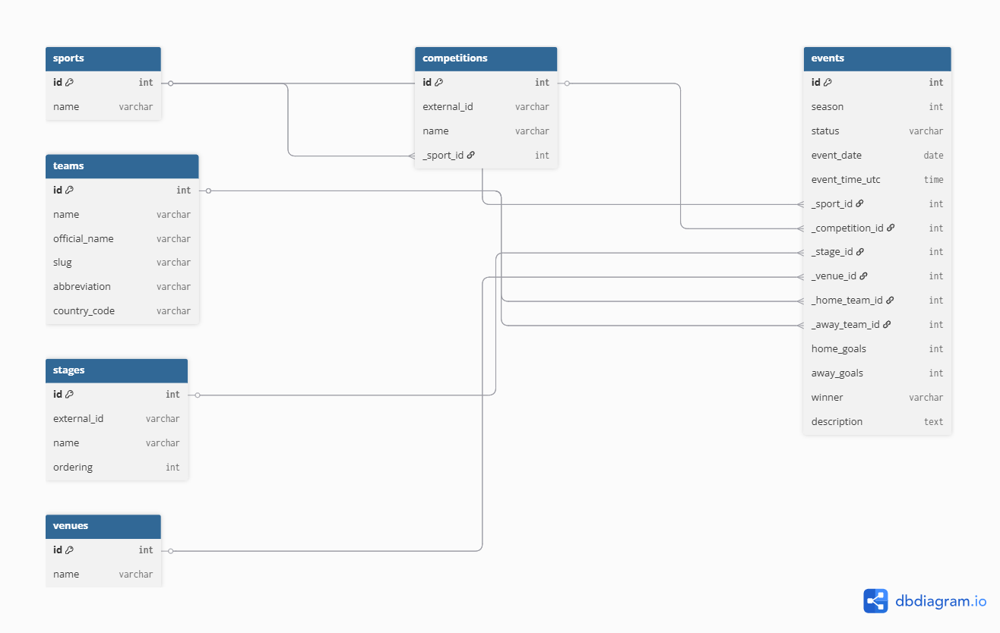

# Sports Event Calendar

## Overview
This project is a Flask + PostgreSQL web application for managing and displaying sports events.

It is being built as part of the Sportradar Coding Academy backend coding exercise. The application will support:
- database modeling for sports events
- event storage in a relational database
- backend functionality to add and retrieve events
- frontend pages to display event data

## Planned Tech Stack
- Python
- Flask
- PostgreSQL
- SQLAlchemy
- Flask-Migrate
- Jinja2 templates
- pytest

## Current Features

- Display all sports events from the database
- View a single event in detail
- Efficient event retrieval using SQLAlchemy eager loading
- Navigation bar with placeholder links
- Basic styling for readability

### Query Efficiency

The event list and event detail views use eager loading for related entities such as teams, competition, stage, venue, and sport. This avoids repeated database queries when rendering templates.

## Notes
The database design will follow a normalized relational structure and will include additional useful entities such as venues and teams/participants.

## Database Design

The database is structured around the `events` table, which stores each sports match together with date, time, season, status, and score information.

Supporting entities are normalized into separate tables:
- `sports` stores sport categories
- `competitions` stores tournament information
- `teams` stores home and away team data
- `stages` stores tournament round information such as "Round of 16" or "Final"
- `venues` stores stadium information when available

The `events` table references these entities through foreign keys:
- `_sport_id`
- `_competition_id`
- `_stage_id`
- `_venue_id`
- `_home_team_id`
- `_away_team_id`

This design reduces duplication and keeps the schema easy to query efficiently for event list and detail pages.

ERD diagram of the database design (from docs/erd.png):


## Setup

1. Clone the repository
2. Create and activate a virtual environment
3. Install dependencies:

```bash
pip install -r requirements.txt
```
4. Create a PostgreSQL database named `sports_calendar`
5. Create a `.env` file based on `.env.example` and set your database credentials
6. Run database migrations:
```bash
flask db upgrade
```
7. Start the application:
```bash
flask run
```

## Sample Data

The project includes a seed script that imports sample sports event data from a JSON file into PostgreSQL.

The imported dataset includes:
- season
- status
- event date and UTC time
- competition
- stage
- home and away team data
- optional stadium information
- optional result data

### Run the seed script

```bash
python seed.py
```
Assumption: the provided sample data does not explicitly include a sport field, so imported sample records are assigned to the `Football` sport category based on the competition context.